# Configuração de Servidor Web utilizando o Docker

## Aplicações utilizadas:

### GitHub, Amazon Web Services, Microsoft Store, WSL, Visual Studio Code, Docker.

<div align="center">
  <br>
  <a href="https://github.com/">
    
  </a>&ensp;

  <a href="https://www.googleadservices.com/pagead/aclk?sa=L&ai=DChcSEwjKuL74ltWLAxXoEUQIHY40KqwYABAAGgJkeg&co=1&ase=2&gclid=CjwKCAiA5eC9BhAuEiwA3CKwQp-uZ-EhfKVs_yaTVCZmvhF8olLyCz4sF_rQXc-KTkKjJ6zjkq_KbRoCmx0QAvD_BwE&ei=46i4Z7zJLbLb5OUP_NnOYQ&ohost=www.google.com&cid=CAESVeD2mSl7f0Xe0yyJImaMygYDsAuUvVqE8TXk7HbEuO8df6HhHkyj13nbeuQIUd6NDilzCovM3hpvmJWnXIKlBj1rDcr0Uva9DVYGZCTyi2T-YG-tn0A&sig=AOD64_3dqO5hHHx21zCm5ROWF8TSPV62pA&q&sqi=2&nis=4&adurl&ved=2ahUKEwj8xrT4ltWLAxWyLbkGHfysMwwQ0Qx6BAgIEAE">
    
  </a>&ensp;

  <a href="https://apps.microsoft.com/home?hl=pt-BR&gl=BR">
    
  </a>&ensp;

  <a href="https://www.microsoft.com/store/productId/9P9TQF7MRM4R?ocid=libraryshare">
    
  </a>&ensp;

  <a href="https://code.visualstudio.com/">
    
  </a>&ensp;

  <a href="https://hub.docker.com/">
    
  </a>&ensp;
</div>

> [!IMPORTANT]
> As únicas aplicações específicas que se pede a utilização no projeto são o **GitHub**, **Amazon Web Services** e o **Docker**. As outras foram questão de preferência!

> [!TIP]
> - **GitHub:** Utilizado para a documentação do projeto.
> - **Amazon Web Services (AWS):** Utilizado para a criação da infraestrutura de TI.
> - **Microsoft Store:** Utilizado para baixar o WSL e o Ubuntu 24.04.
> - **WSL (Windows Subsystem for Linux):** Permite executar um ambiente Linux diretamente no sistema operacional Windows.
> - **Visual Studio Code:** Utilizado como editor de código e terminal.
> - **Docker:** Utilizado um container do wordpress como servidor web.

---

## Linguagens utilizadas:

### Bash, Markdown.

<div align="left">
  <br>
  <a href="https://www.gnu.org/software/bash/">
    
  </a>&ensp;

  <a href="https://www.markdownguide.org/">
    
  </a>&ensp;
</div>

> [!IMPORTANT]
> Você pode utilizar a linguagem Python ao invés de Bash.

> [!TIP]
> - **Bash:** É uma linguagem de script e um interpretador de comandos.
> - **Markdown:** É uma linguagem de marcação leve.

---


O projeto consiste em utilizar uma instância na AWS que conterá o Docker (estamos usando o contêiner do WordPress), que por sua vez, teremos que fazer uma integração utilizando múltiplos serviços, sendo eles:

- EFS
- RDS
- CLB/ALB
- ASG
- CloudWatch

```
1. Instalação e configuração do DOCKER ou CONTAINERD no host EC2; SEGUIR DESENHO TOPOLOGIA DISPOSTA. `Ponto adicional para o trabalho utilizar a instalação via script deStart Instance (user_data.sh)`

2. Efetuar Deploy de uma aplicação Wordpress com: container de aplicação RDS database Mysql. 

3. Configuração da utilização do serviço EFS AWS para estáticos do container de aplicação Wordpress .

4. Configuração do serviço de Load Balancer AWS para a aplicação Wordpress.

```

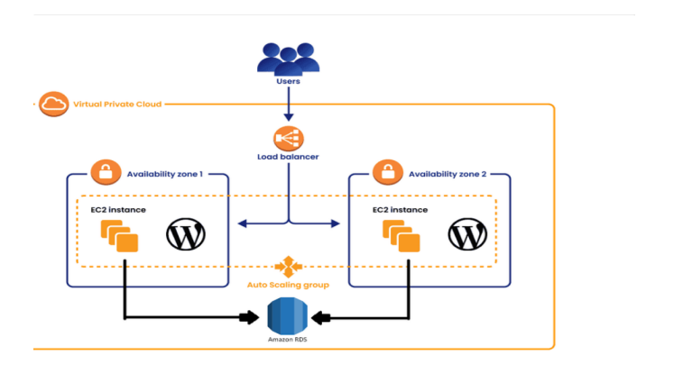

<hr>

## Estágios do Projeto de forma resumida:

<div>
<details align="left">
    <summary></summary>
1. Rodar o wordpress local ✅
  
2. Criar a VPC, EC2 ✅
   
3. Criou o RDS ✅
   
4. Instalou o Docker na EC2 ✅
   
5. Rodou o Wordpress na EC2 ✅
   
6. Criou um script de inicialização no User Data e o testou ✅
    
7. Criou o auto-scaling group e balanceador de Carga ✅
    
8. Criou regras de scaling ✅
    
9. Monitoramento no Cloudwatch ✅

### Pontos de atenção:

- Não utilizar ip público para saída do serviços WP (Evitem publicar o serviço WP via IP Público) 
- Sugestão para o tráfego de internet sair pelo LB (Load Balancer Classic)
- Pastas públicas e estáticos do wordpress sugestão de utilizar o EFS (Elastic File Sistem)
- Fica a critério de cada integrante usar Dockerfile ou Dockercompose;
- Necessário demonstrar a aplicação wordpress funcionando (tela de login) 
- Aplicação Wordpress precisa estar rodando na porta 80 ou 8080;
- Utilizar repositório git para versionamento; 
- Criar documentação.

</details>
</div>

## Conclusão:

### Primeira etapa `local`: Criação do ambiente de testes.

<div>
<details align="left">
    <summary></summary>
1 - Baixe o wsl (Pela loja da Microsoft || Por linha de comando).

```
wsl --install
```


2 - Instale a versão mais atual do ubuntu (Pela loja da Microsoft || Por linha de comando).

```
wsl --install -d Ubuntu-24.04
```

3 - Instale o um editor de código de sua preferência (VScode).

```
https://code.visualstudio.com/download
```

4 - Faça um conexão ao wsl.

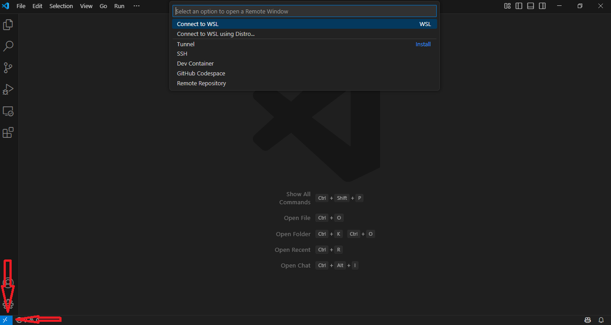

```
Assim que você entrar no vscode já com o wsl instalado ele vai te recomendar que baixe uma extensão chamada wsl, após a instalação você podera clicar no simbolo >< no canto inferior esquerdo e após isso é só apertar em "Connect to WSL" e estará dentro da maquina !! 
```

5 - Atualize a maquina.

```
sudo apt update && sudo apt upgrade -y
```

6 - Instale o docker && docker compose.

```
1- sudo apt install -y ca-certificates curl gnupg

2- sudo install -m 0755 -d /etc/apt/keyrings
curl -fsSL https://download.docker.com/linux/ubuntu/gpg | sudo gpg --dearmor -o /etc/apt/keyrings/docker.gpg
sudo chmod a+r /etc/apt/keyrings/docker.gpg

3- echo \
  "deb [arch=$(dpkg --print-architecture) signed-by=/etc/apt/keyrings/docker.gpg] https://download.docker.com/linux/ubuntu \
  $(. /etc/os-release && echo "$VERSION_CODENAME") stable" | \
  sudo tee /etc/apt/sources.list.d/docker.list > /dev/null

4- sudo apt update

5- sudo apt install -y docker-ce docker-ce-cli containerd.io docker-buildx-plugin docker-compose-plugin

6- sudo usermod -aG docker $USER

7- sudo systemctl enable docker
sudo systemctl start docker

----------------------------------------------------------------------------------------

1- Instale as dependências necessárias.
2- Adicione a chave GPG oficial do Docker.
3- Adicione o repositório do Docker ao APT.
4- Atualize novamente.
5- Instale o Docker && o docker compose.
6- Adicione seu usuário ao grupo `docker` (Opcional).
7- Habilite o Docker para iniciar com o sistema (Opcional).
```
</div>

### Segunda etapa `local`: Teste de implementação do *Wordpress*.

<div>
<details align="left">
    <summary></summary>
1-  Criar uma abstração dos volumes e redes (Opcional).

```
----------------------------------------------------------------------------------------

|- NETWORK
|-- NAME 'tunel'

----------------------------------------------------------------------------------------

|- VOLUMES
|-- NAME wordp
|-- NAME dbm

----------------------------------------------------------------------------------------

Projeto: foi definido que o nome da rede será 'tunel' e que será criado dois volumes, um para armazenar os arquivos do site(wordp) e o outro, arquivos referentes ao banco de dados(dbm).
```

2- Criar volumes para arquivos do site e do banco de dados.

```
1- docker volume create wordp

2- docker volume create dbm

3- docker volume ls

----------------------------------------------------------------------------------------

1- Cria um volume para o Wordpress.
2- Cria um volume para o Banco de dados mysql.
3- Listas os volumes.
```


3- Criar uma rede para permitir uma conexão entre o banco e o site.

```
1- docker network create tunel

2- docker network ls

----------------------------------------------------------------------------------------

1- Cria uma rede com o nome 'tunel'.
2- Lista as redes.
```

4- Criar pastas para armazenar arquivos referentes ao projeto.

```
1- mkdir projetinho
2- cd projetinho

----------------------------------------------------------------------------------------

1- Cria uma diretório com o nome 'projetinho'
2- Entra no diretório especificado (Por mais leigo que seja, fazer uma estrutura para um projeto é essencial).
```

5- Checar a documentação  do docker-hub

```
https://hub.docker.com/_/wordpress
```

6- Criar uma abstração do banco de dados (Opcional).

```
|- DB NAME 'projetinho'
|-- DB USER 'cariani'
|-- DB PASSWORD '0311'
```

7- Criar um compose seguindo a documentação acima.

nano `docker-compose.yml`: 
```
services:
  web:
    image: wordpress
    restart: always
    ports:
      - "80:80"
    environment:
      WORDPRESS_DB_HOST: db
      WORDPRESS_DB_USER: cariani
      WORDPRESS_DB_PASSWORD: 0311
      WORDPRESS_DB_NAME: projetinho
    volumes:
      - wordp:/var/www/html
    networks:
      - tunel

  db:
    image: mysql:8.0
    restart: always
    environment:
      MYSQL_DATABASE: projetinho
      MYSQL_USER: cariani
      MYSQL_PASSWORD: 0311
      MYSQL_RANDOM_ROOT_PASSWORD: '1'
    volumes:
      - dbm:/var/lib/mysql
    networks:
      - tunel

networks:
  tunel:
    driver: bridge

volumes:
  wordp:
  dbm:

```

8- Executar o compose, e após o teste apagar ele.

```
1- docker compose up -d

2- docker compose down

----------------------------------------------------------------------------------------
 
1- Executa o arquivo 'docker-compose.yml'
2- Exclui os containers gerados(Caso não tenha criado os volumes e a rede antes de executar, o mesmo irá criar as redes serão excluidas más os volumes permanecerão)
```

9- Resultado.

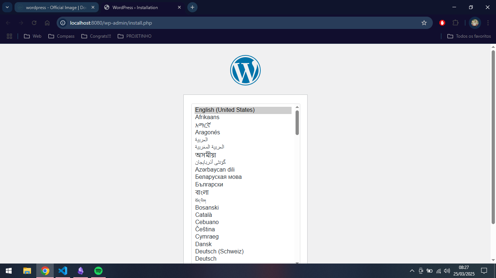

<br>

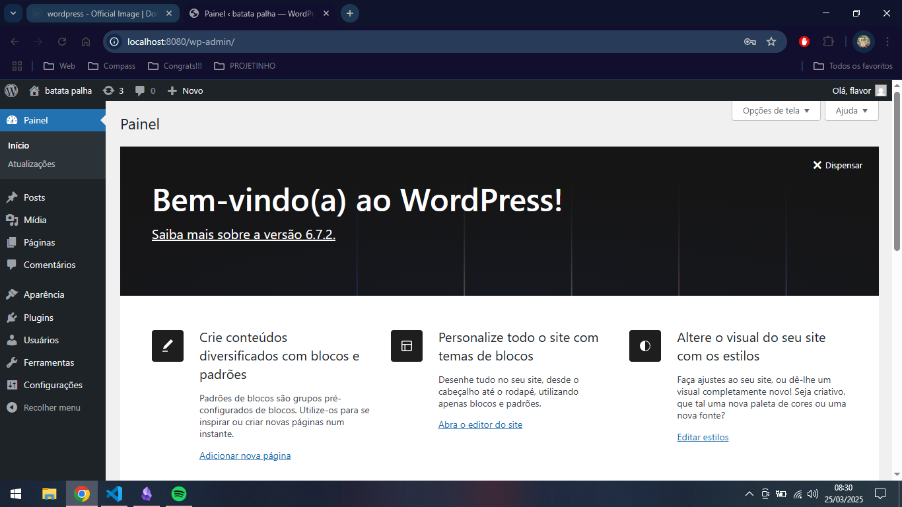
</div>

### EFS ON Linux Manual

<div>
<details align="left">
    <summary></summary>

1- Criar o grupo de segurança para o EFS

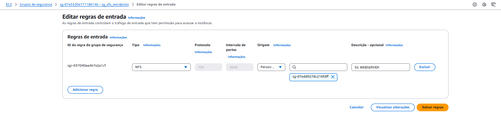
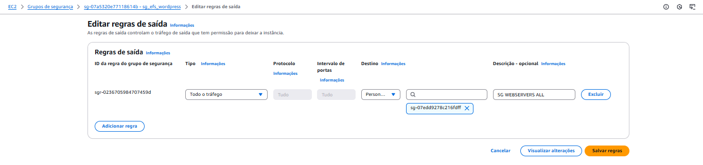

2- Criar um EFS.

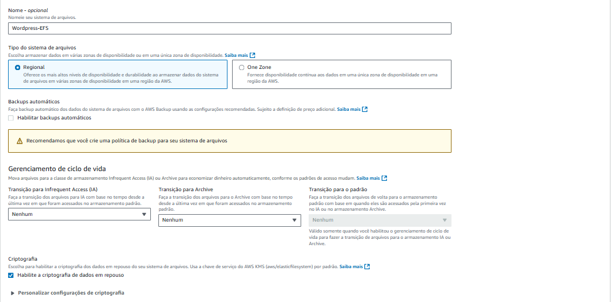
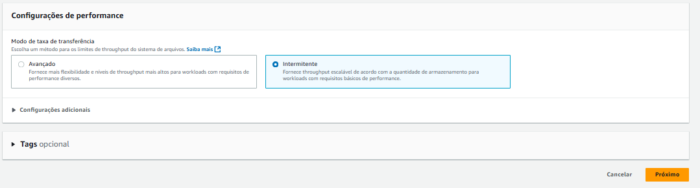


<hr>

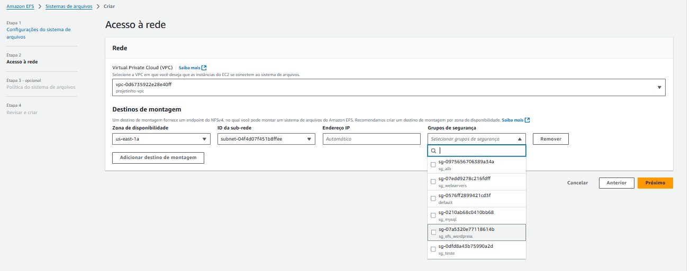
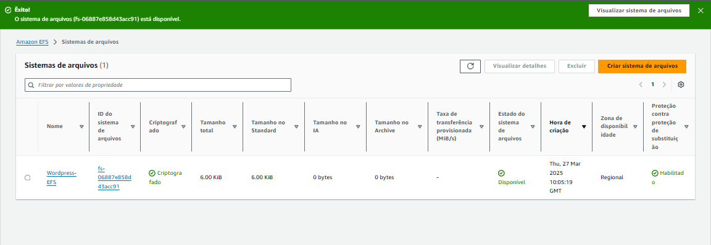

<hr>
3- Montagem manualmente da pasta

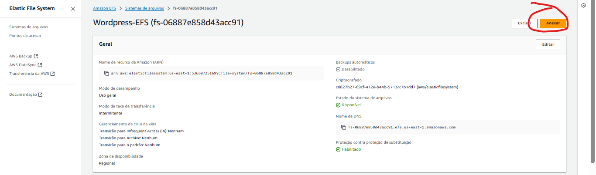
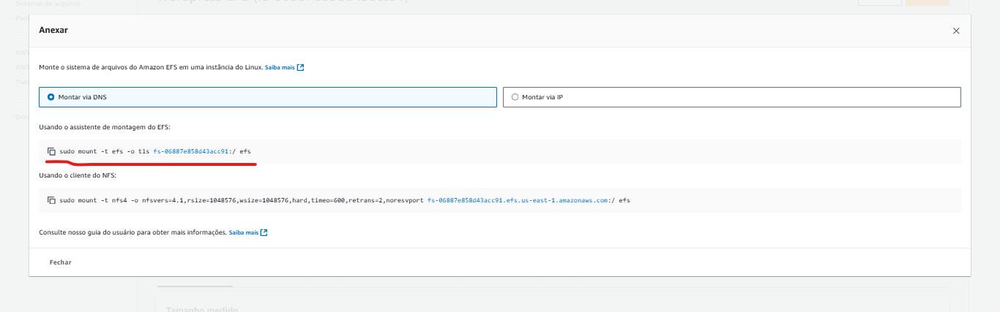

4- Entrar na EC2 via ssh

5- Instale os pacotes necessários

Documentação Linux: https://docs.aws.amazon.com/pt_br/efs/latest/ug/using-amazon-efs-utils.html
Documentação oficial para outras distribuições: https://docs.aws.amazon.com/pt_br/efs/latest/ug/installing-amazon-efs-utils.html (não funciona, testei somente na distribuição do ubuntu)

no `Linux`:
```
sudo yum install amazon-efs-utils -y
```

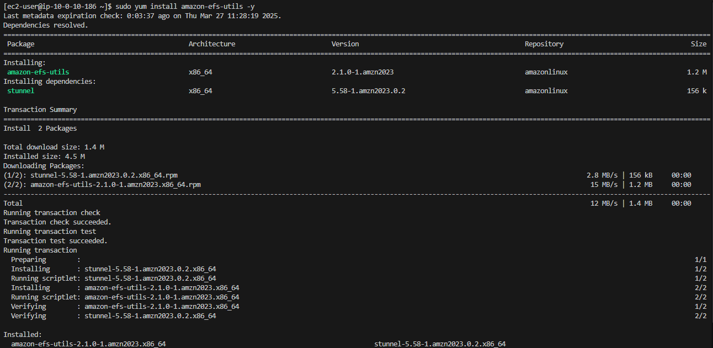

no `Ubuntu`:
```
$ sudo apt-get update
$ sudo apt-get -y install git binutils rustc cargo pkg-config libssl-dev gettext
$ git clone https://github.com/aws/efs-utils
$ cd efs-utils
$ ./build-deb.sh
$ sudo apt-get -y install ./build/amazon-efs-utils*deb
```

6- Monte uma pasta

```
Crie uma pasta para fazer a montagem

mkdir wordpress

Cole o que copiamos do nosso efs para um montagem manual

Exemplo: sudo mount -t efs -o tls fs-06887e858d43acc91:/ wordpress
```

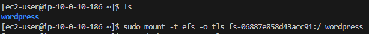

7- Execute o Wordpress e seja feliz

nano `docker-compose.yml`:
```
services:
  web:
    image: wordpress
    restart: always
    ports:
      - "80:80"
    environment:
      WORDPRESS_DB_HOST: 
      WORDPRESS_DB_USER: flavor
      WORDPRESS_DB_PASSWORD: 998049352
      WORDPRESS_DB_NAME: db_projetinho
    volumes:
      - /home/ec2-user/wordpress:/var/www/html
    networks:
      - tunel

networks:
  tunel:
    driver: bridge
```

comando pra executar o container 
```
Linux:
docker-compose up -d

---------------------------------------------------------
Ubuntu:
docker compose up -d
```
Antes de executar o wordpress:


<hr>

Executando a instalação do wordpress:
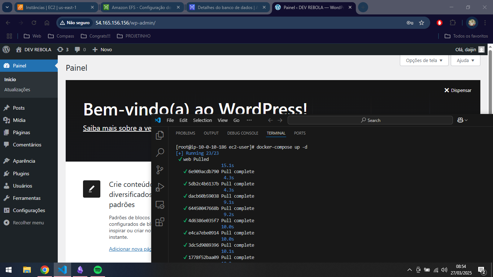

No monitoramento:
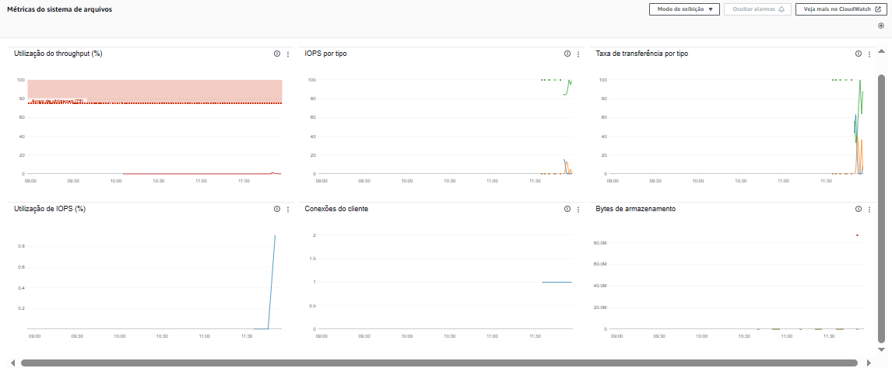

Conteúdo na pasta:
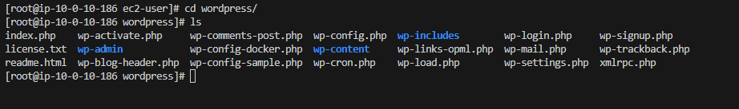

- Testando em uma Ec2 em outra região

Adicione a região nas configurações de rede do EFS:
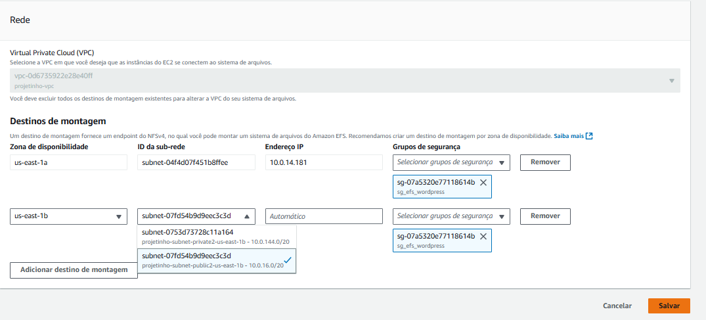

Após isso é só entrar na outra ec2, criar uma pasta com o mesmo nome e por fim entrar nela e verificar se o conteúdo está lá:
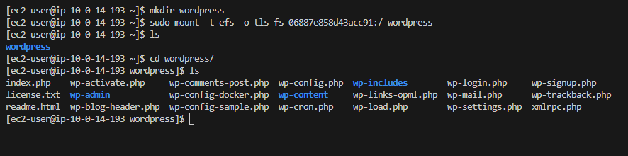

</div>


### Primeira etapa `AWS`: Criação da topologia da rede e seus grupos de segurança com teste sem ALB && ASG.

<div>
<details align="left">
    <summary></summary>
1- Criar a VPC

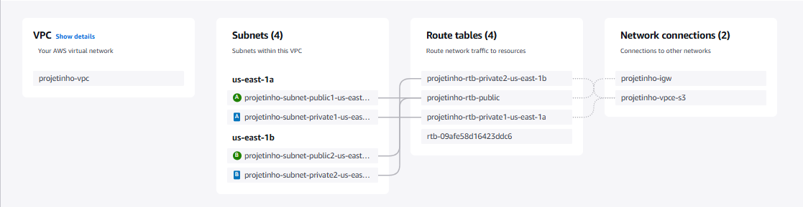

2- Criar os grupos de segurança.

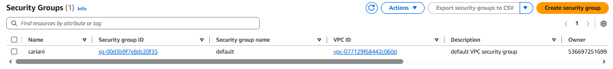

3- Criar o banco de dados(RDS).

```
Especificações: 

- RDS com MySQL, sem Multi-AZ e instâncias db.t3.micro

----------------------------------------------------------------------------------------

|- NAME DB 'db-wordpress'
|-- NAME USER 'flavor'
|-- PASSWORD '998049352'
|--- DATABASE NAME 'db_projetinho'

```
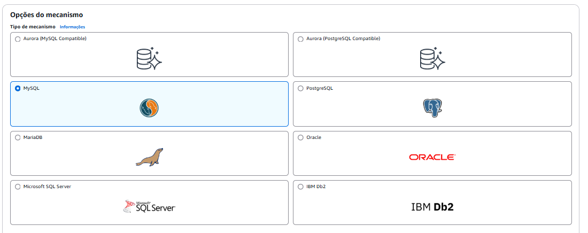

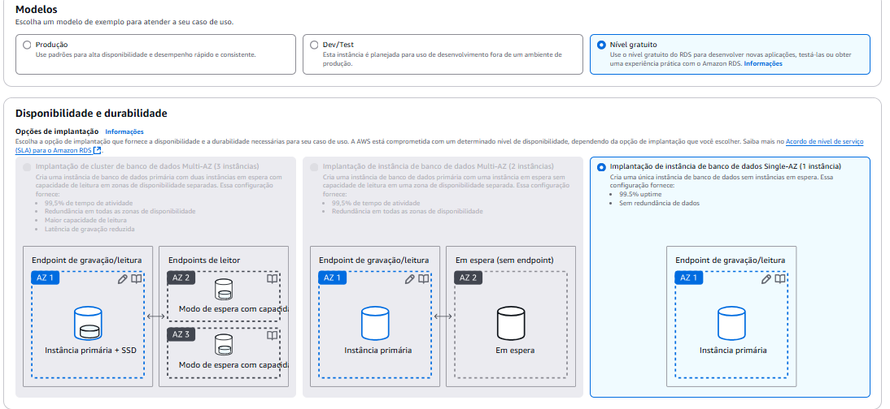

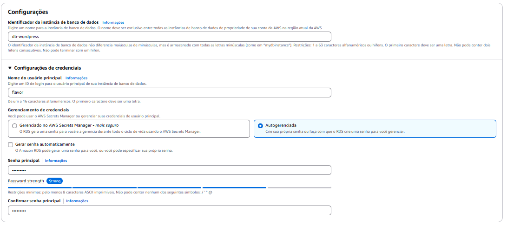


```
Após a criação do banco de dados, RDS > escolha o seu banco > security > altere a regra de entrada pro grupo de segurança que vai estar sua ec2.
```

4- Criar uma EC2.

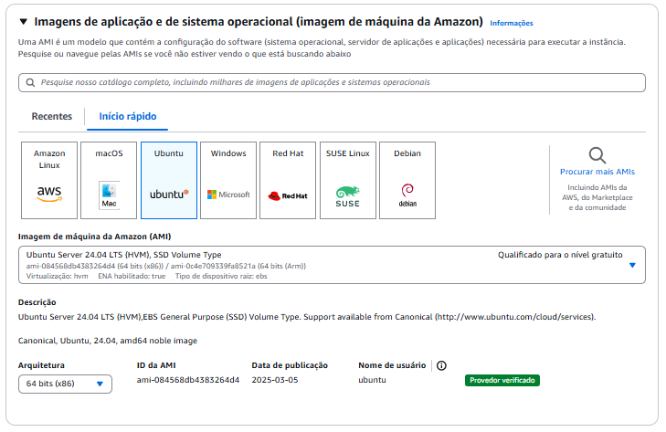

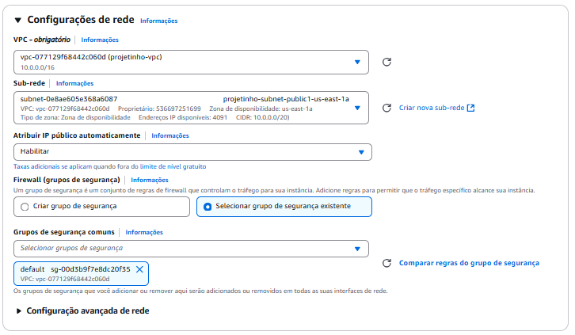

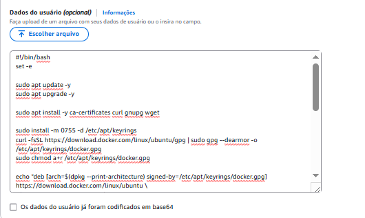


Documento utilizado no`userdata`:
```
#!/bin/bash

 sudo apt update -y
 sudo apt upgrade -y
 
 sudo apt install -y ca-certificates curl gnupg wget
 
 sudo install -m 0755 -d /etc/apt/keyrings
 curl -fsSL https://download.docker.com/linux/ubuntu/gpg | sudo gpg --dearmor -o /etc/apt/keyrings/docker.gpg
 sudo chmod a+r /etc/apt/keyrings/docker.gpg
 
 echo "deb [arch=$(dpkg --print-architecture) signed-by=/etc/apt/keyrings/docker.gpg] https://download.docker.com/linux/ubuntu \
   $(. /etc/os-release && echo "$VERSION_CODENAME") stable" | \
   sudo tee /etc/apt/sources.list.d/docker.list > /dev/null
 
 sudo apt update -y
 sudo apt install -y docker-ce docker-ce-cli containerd.io docker-buildx-plugin docker-compose-plugin
 
 sudo apt install -y mysql-client
 
 sudo usermod -aG docker $USER
 
 newgrp docker
 
 sudo systemctl enable docker
 sudo systemctl start docker
```

5- Entar na EC2 via ssh.

6- Baixar o *mysql-client* para testar a conectividade com o banco de dados

```
sudo apt install -y mysql-client

----------------------------------------------------------------------------------------

mysql -h [ENDEREÇO_DO_BANCO] -u [USUÁRIO] -p -e "SHOW DATABASES;"
```

nano `docker-compose.yml`: 
```
services:
  web:
    image: wordpress
    restart: always
    ports:
      - "80:80"
    environment:
      WORDPRESS_DB_HOST: db-wordpress.c98i000mqf2o.us-east-1.rds.amazonaws.com
      WORDPRESS_DB_USER: flavor
      WORDPRESS_DB_PASSWORD: 998049352
      WORDPRESS_DB_NAME: db_projetinho
    networks:
      - tunel

networks:
  tunel:
    driver: bridge
```

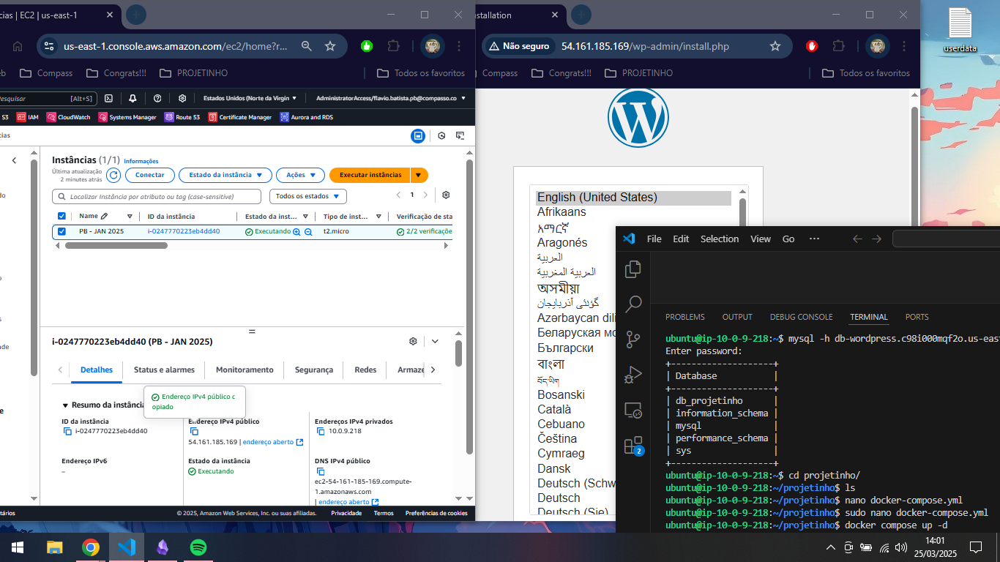

</div>

### Segunda etapa `AWS`: Aplicação do auto-scaling group com balanceador de carga, regras de scaling e CloudWatch.

<div>
<details align="left">
    <summary></summary>

1 - Criar uma VPC.

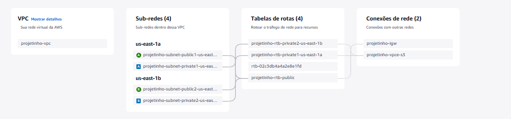

2 - Fazer com que as Sub-redes publicas tenham o IP publico atribuído automaticamente

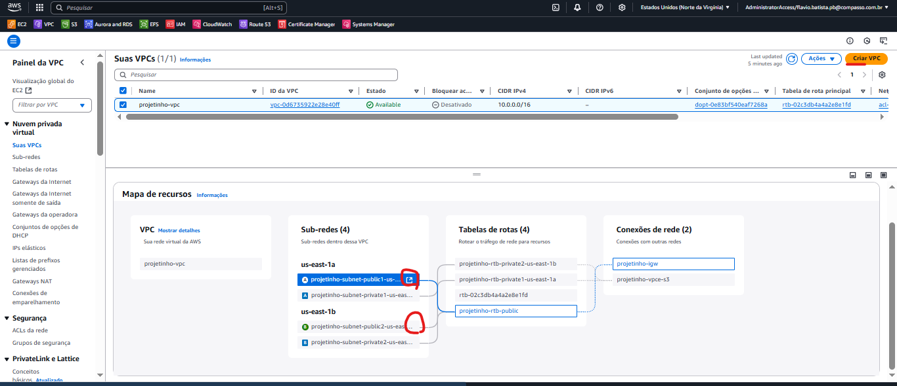

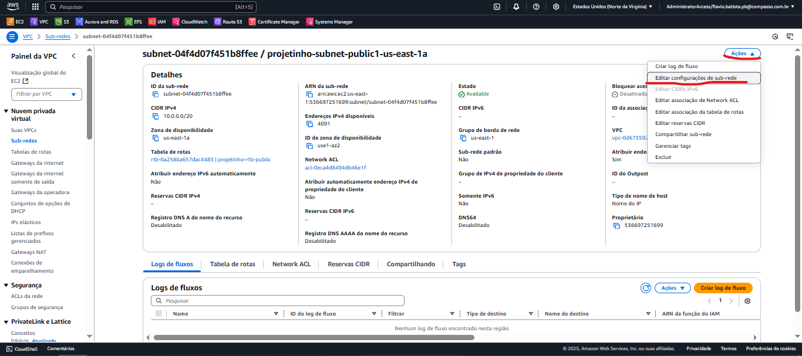

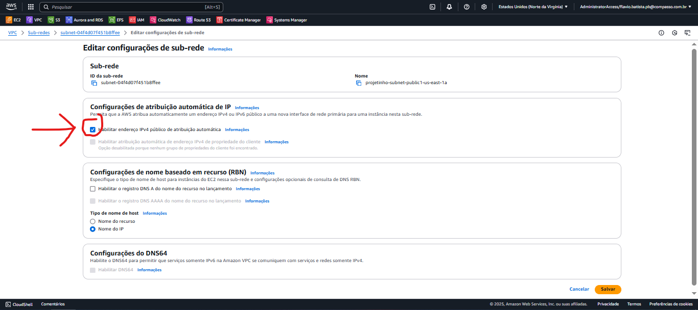

3- Criar um grupo de segurança para o servidor web (sem regras de entrada ou saída).

4- Criar um grupo de segurança para o RDS (mysql).


5- Criar um grupo de segurança para o EFS.


6- Criar um grupo de segurança para o ALB || CLB.


7- Editar o grupo de segurança do WebServer que está vazio (conterá nossa aplicação do wordpress).


8- Criar o EFS.

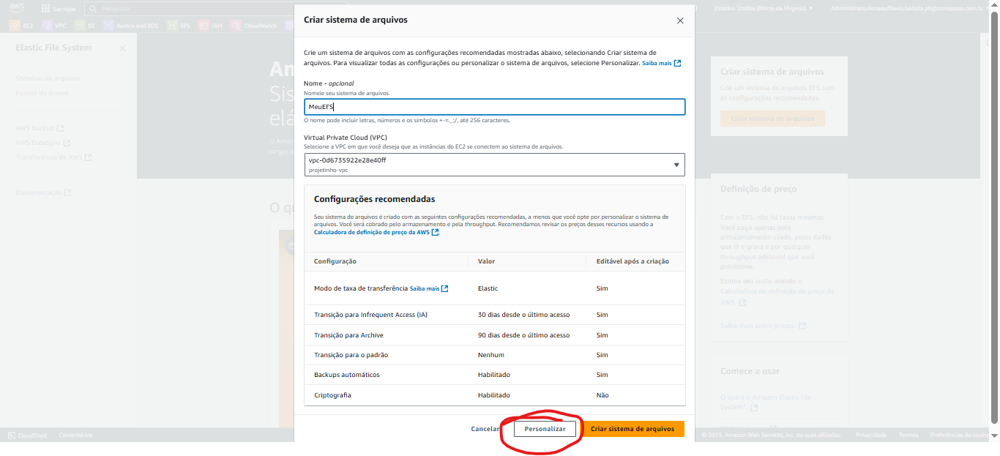

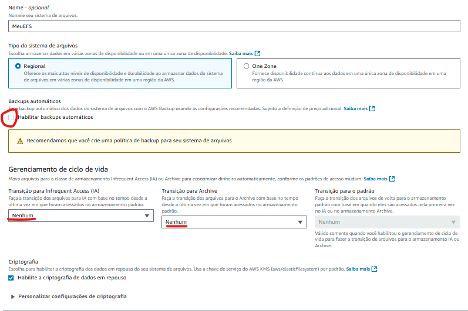

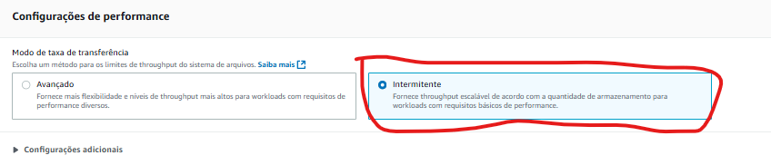

1) `Aperte para ir para próxima aba`

2) `Selecionar o grupo de segurança do EFS criado anteriormente`


3)  `Só avançar até terminar`

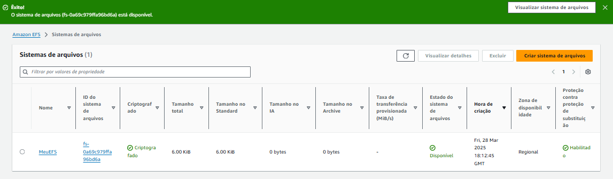

9- Criar o RDS.

1)  `Escolher a ultima versão disponível`

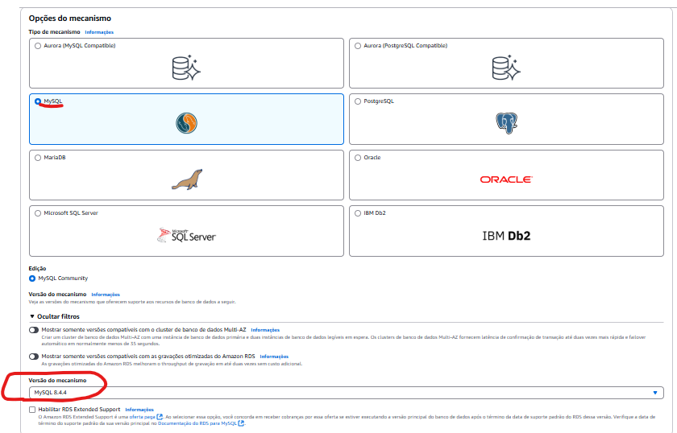

2)  `Escolher o nivel gratuito`

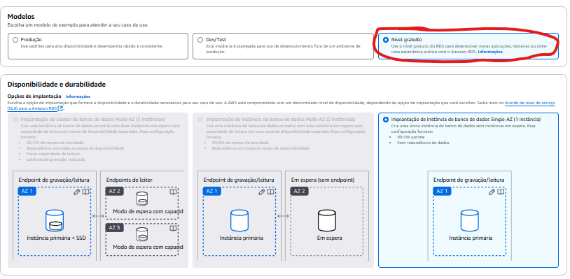

3)  `Guardar essas informações:`

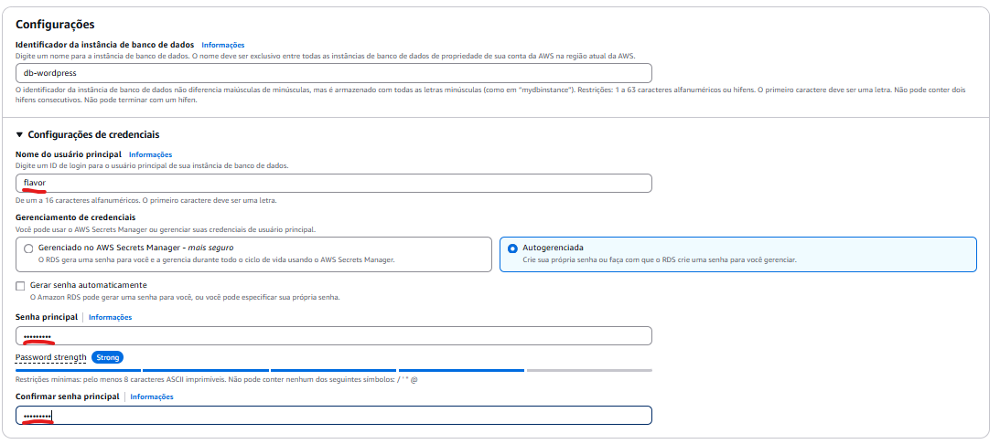

4)  `Mudar para t3 micro:`

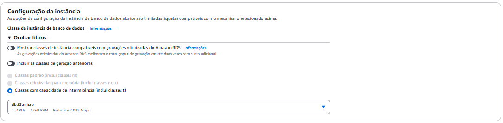

5)  `Alterar o limite maximo de armazenamento escalonavel:`

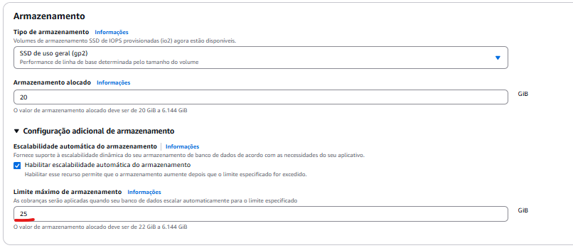

6)  `Verificar se está na VPC correta:`

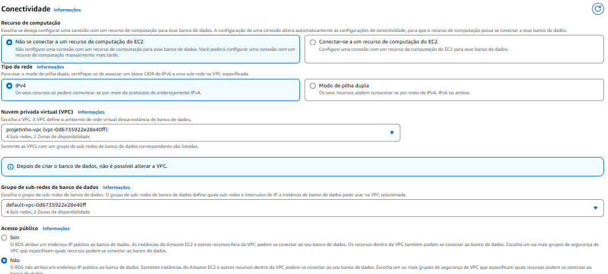

7)  `Selecionar o grupo de segurança do RDS`

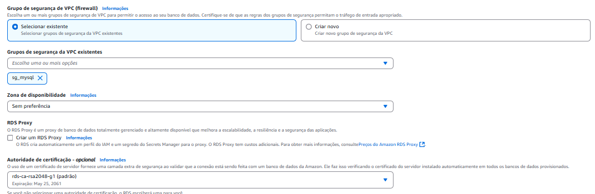

8)  `Antes de finalizar a criação RDS, definir um nome pro banco de dados inicial e guardar essa informação`

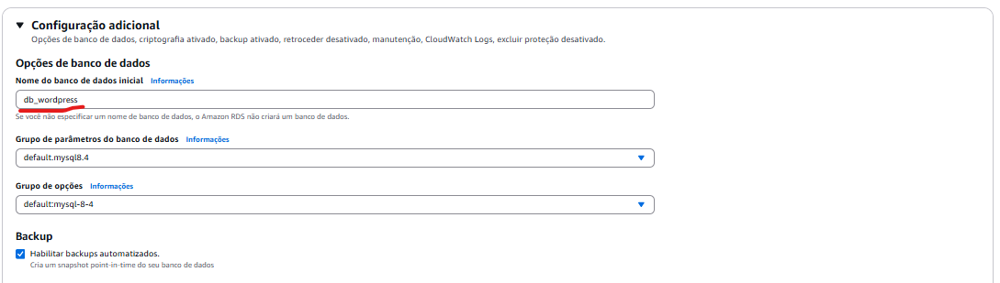

9)  `O banco demora bastante pra subir`


10- Pegar e armazenar o endereço do banco de dados && o ponto de montagem EFS.

1) `RDS`

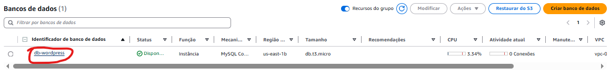

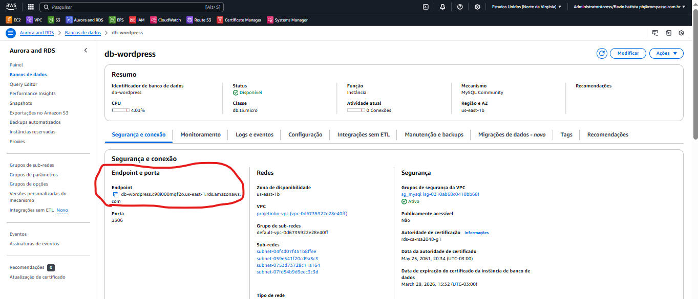

2) `EFS`

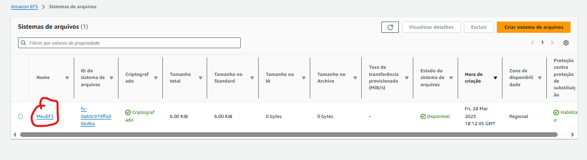

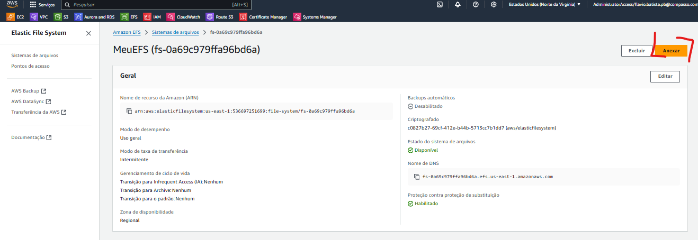

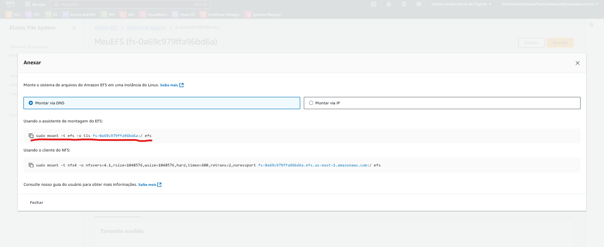

11- Alterar esse userdata && o docker-compose.yml para que contenha suas informações

`userdata`
```
#!/bin/bash

sudo yum update -y
sudo yum install -y docker wget amazon-efs-utils

sudo service docker start
sudo systemctl enable docker.service
sudo usermod -aG docker ec2-user

sudo curl -L "https://github.com/docker/compose/releases/latest/download/docker-compose-$(uname -s)-$(uname -m)" -o /usr/local/bin/docker-compose
sudo chmod +x /usr/local/bin/docker-compose

sudo mkdir -p /wordpress <<<<<< trocar o nome da pasta pra um de sua vontade
sudo mount -t efs -o tls fs-0a69c979ffa96bd6a:/ /wordpress  <<<<<<< fazer o mesmo aqui

if mountpoint -q /wordpress; then
    echo "EFS montado com sucesso em /wordpress"
else
    echo "Falha ao montar EFS"
    exit 1
fi

wget -O /home/ec2-user/docker-compose.yml https://raw.githubusercontent.com/Daijinpala/AVA4_24032025/main/POTATO%20SCRIPT/docker-compose.yml

sudo chown ec2-user:ec2-user /home/ec2-user/docker-compose.yml

cd /home/ec2-user
sudo docker-compose up -d
```

`docker-compose.yml`
```
services:
  web:
    image: wordpress
    restart: always
    ports:
      - "80:80"
    environment:
      WORDPRESS_DB_HOST: seu_endpoint_do_banco_de_dados
      WORDPRESS_DB_USER: o_usuario_do_seu_rds
      WORDPRESS_DB_PASSWORD: sua_senha
      WORDPRESS_DB_NAME: o_nome_da_sua_database
    volumes:
      - /home/ec2-user/pastadesuapreferencia:/var/www/html
    networks:
      - tunel

networks:
  tunel:
    driver: bridge
```

12- Criar um Modelo de Execução (Lauch Template)

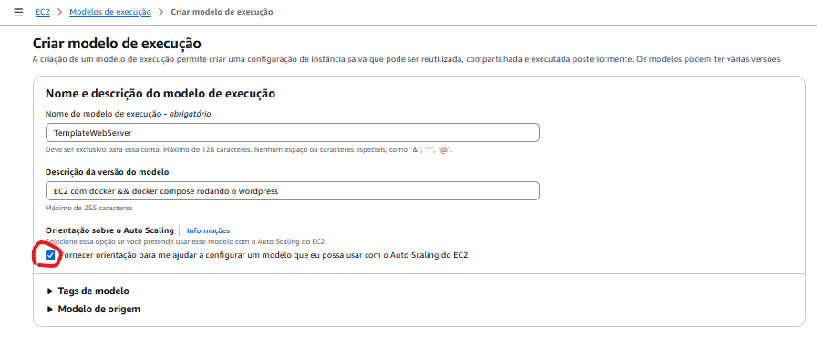

1)  `Escolher o linux aws (o userdata que criei só funciona nele)`

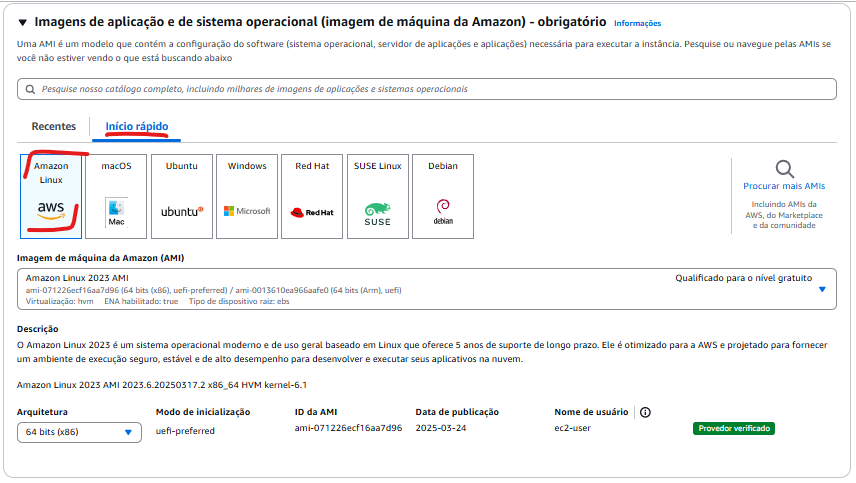

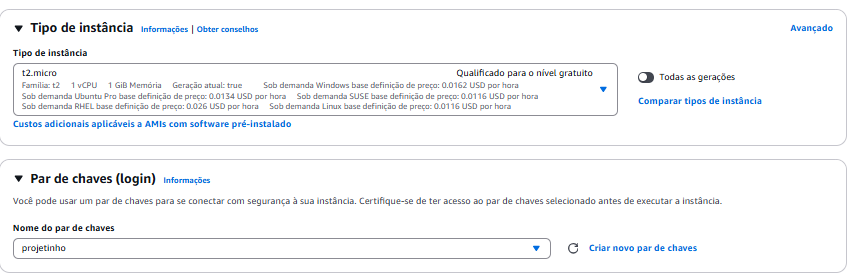

2)  `Não escolha uma sub-rede especifica e escolha o grupo de segurança criado para os servidores web`

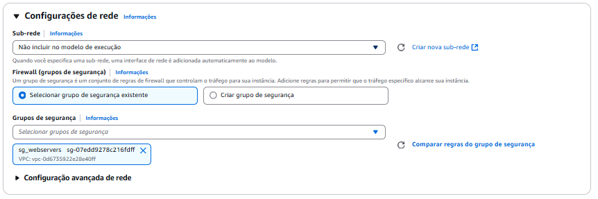

3)  `Colocar as Tags que a patricia passou nas tags de recurso, nos detalhes avançados colocar o arquivo no user-data (observação: terá que trocar o ponto de montagem pelo que está no seu EFS)`

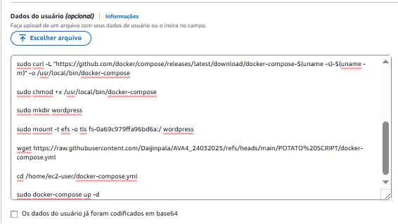

13- Criar um CLB

1)  `Clique em criar um loadbalancer`

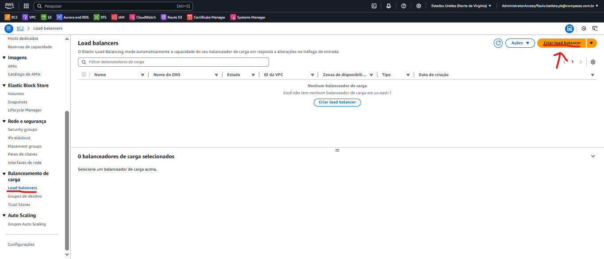

2)  `Selecione o CLB, note que ele aparce em um neu adicional`


3)  `Coloque um nome nele e escolha as subnets que serão responsaveis pelo servidor web`

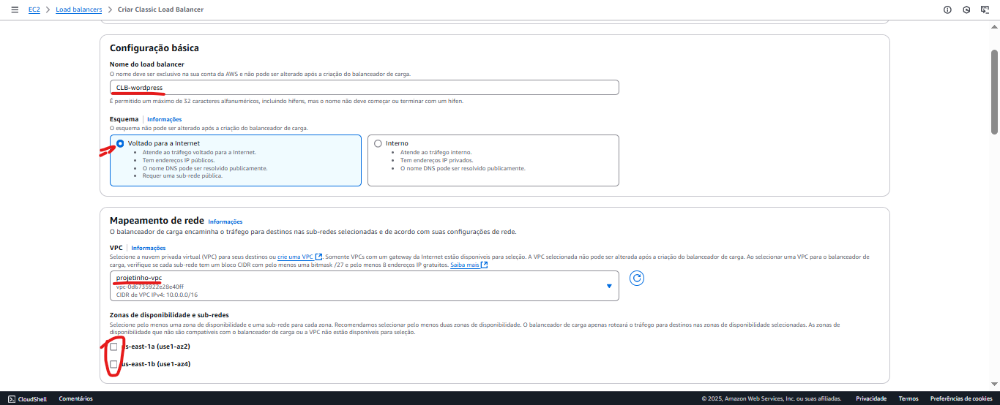

4)  `Altere aonde será feito o teste  de HC (por padrão ele vem como "/index.html")`

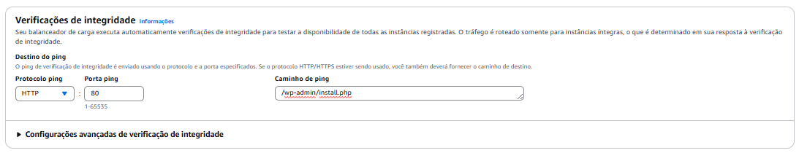

5)  `Criado com sucesso`

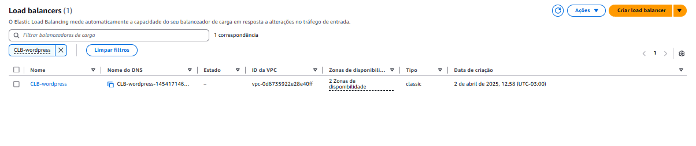

14- Criar o ASG com o ALB || CLB.

1)  `Colocar um nome && ecolher o launch template que criamos anteriormente`

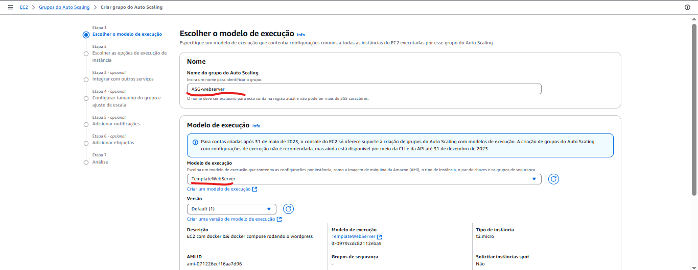

2)  `Escolher as subnetes publicas de zonas diferentes para o LT`

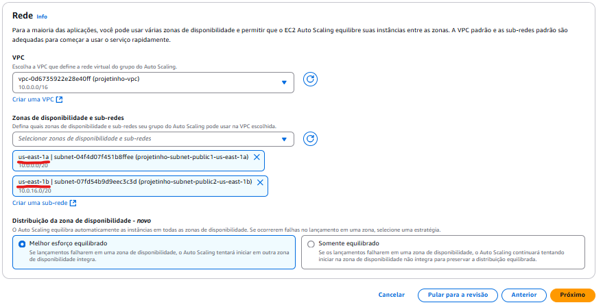

3) `utilizando o classic Load Balancer criado anteriormente`

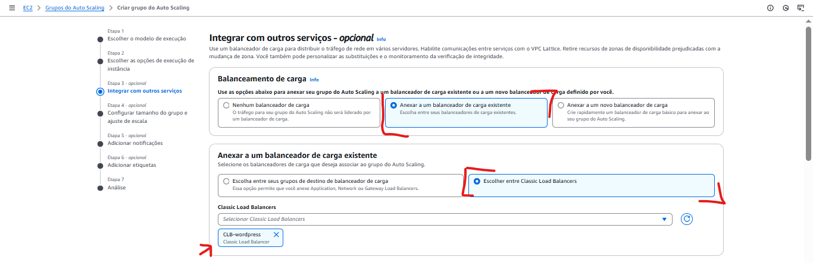

4)  `Caso queira utilizar o ALB`

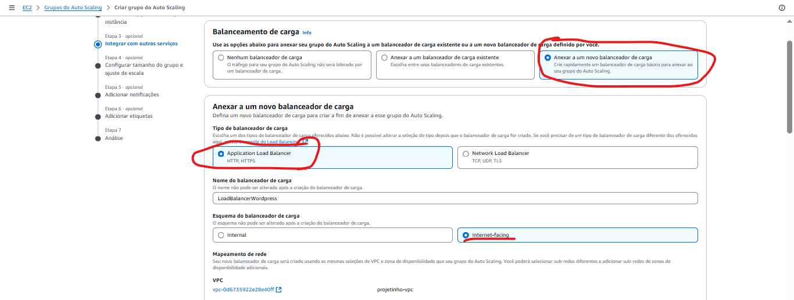
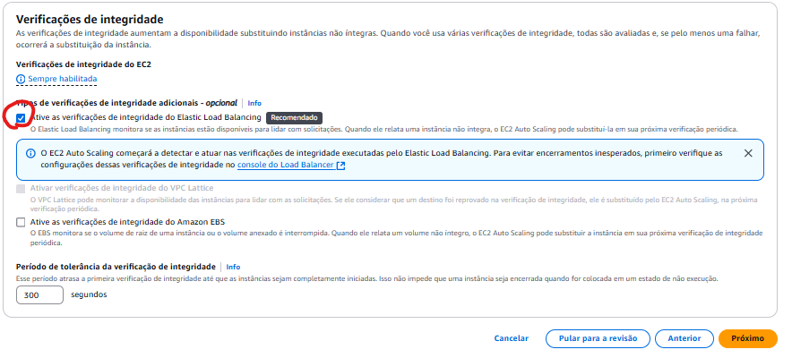

5)  `Habilite o monitoramento do cloudwatch`


6)  `Crie uma tag personalizada para saber quais são as instancias criadas pelo asg`

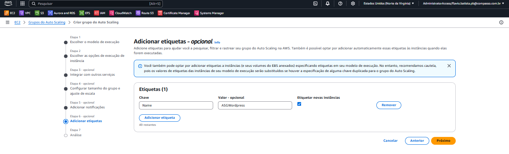

7)  `Caso tenha utilizado o ALB, entre no seu loadbalancer, se você criou ele pelo ASG ele vai vir como padrão o grupo de segurança do seu webserver troque pelo o do ALB criado anteriormente`

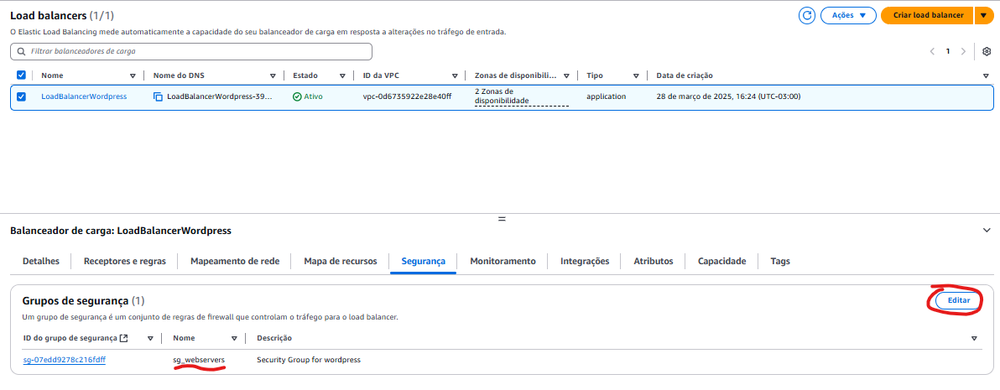

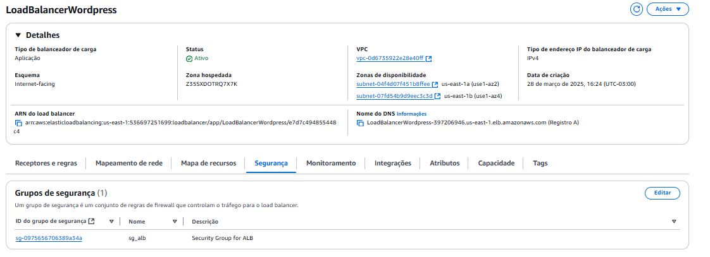

8)  `Após terminar os testes reduza o numero de maquinas minimas e maximas para 0 no ASG (Auto Scaling Group), ele mesmo vai encerrar as instancias, só que demora`

15- `Aplicando monitoramento e manutenção com o cloudwatch`

1)  `Selecione o ASG que criamos anteriormente`

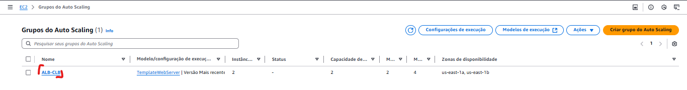

2)  `Em escalabilidade automática crie uma politica`

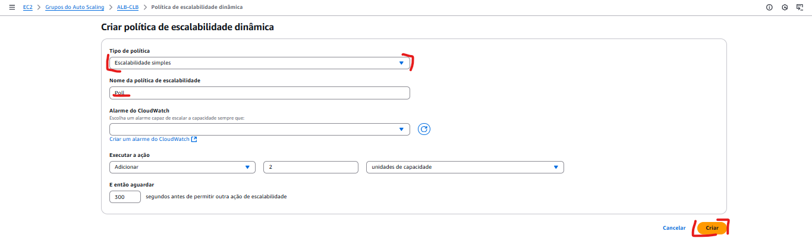

3)  `Crie ela utilizando a escalabilidade simples, coloque um nome e por fim adicione instancias(estaremos criando uma regra mais a fente que quando a utilização da cpu > 84% ela suba mais duas instancias)`


4)  `Agora em cloudwatch e em alarmes, crie um alarme`

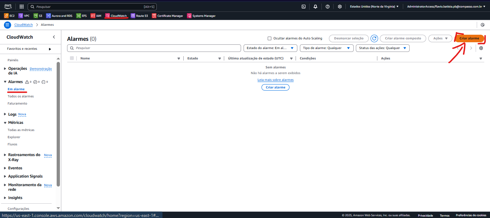

5)  `Selecione uma métrica`

```
EC2 > By auto Scaling group > CPUutilization
```

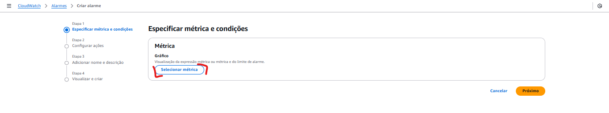

6)  `Defina que se a utilização da cpu estiver acima de 85% de utilização aconteça ele executrá a politica de escalabilidade automatica`

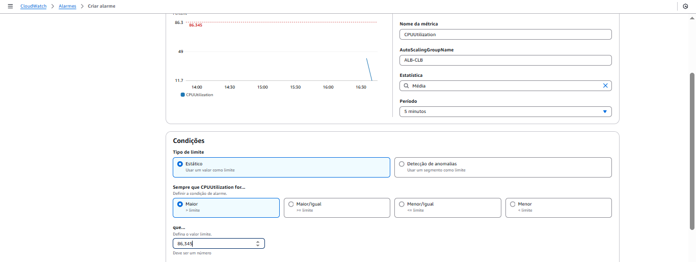

7)  `Selecione a politica que criamos no passo 2`

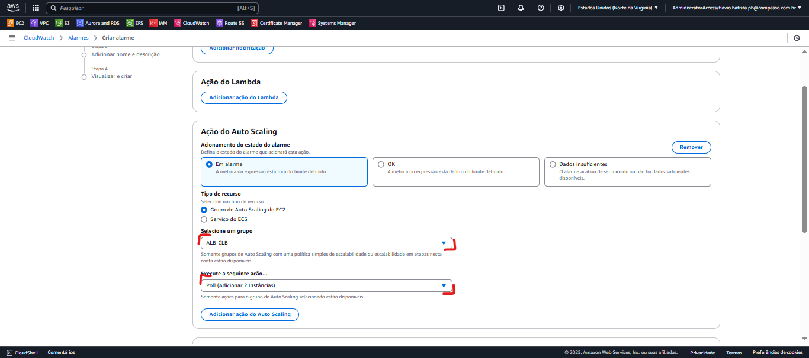

8)  `De um nome ao alarme`

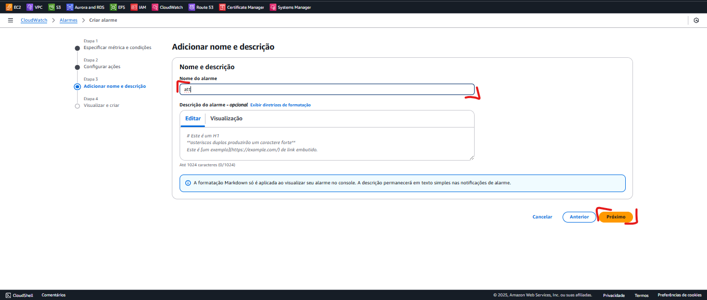

9)  `FIM`

16- Teste.

1)  `Verifique a criação das ec2 e suas zonas de disponibilidade`


2)  `Acesse o DNS do seu LB pelo navegador:`

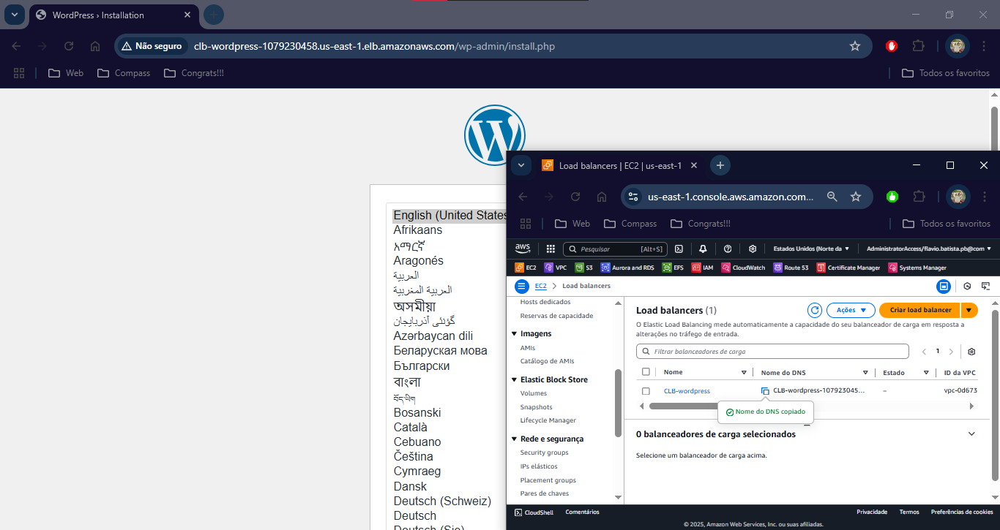
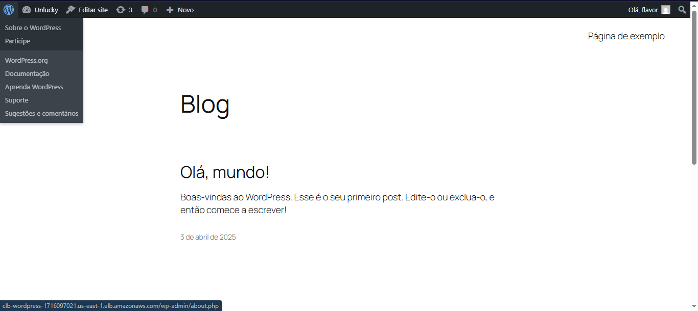

3)  `Acesse as métricas pelo CloudWatch`

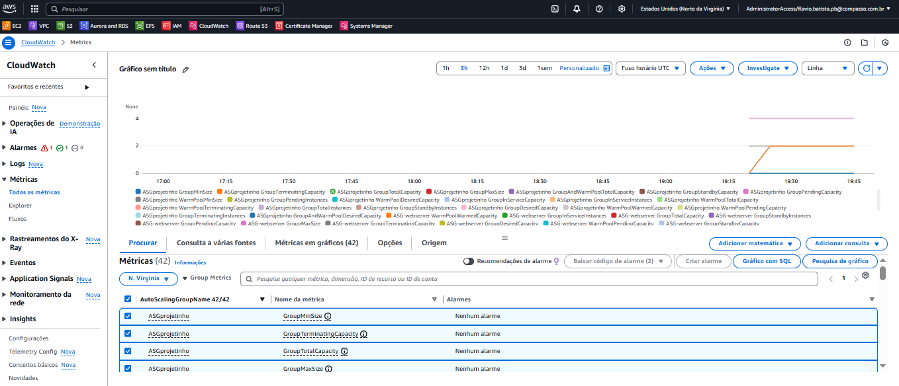

4) `Acione o alarme que criamos anteriormente e veja o resultado:`

```
1- Abra o cloudshell

2-aws cloudwatch set-alarm-state --alarm-name "nome do alarme que criamos" --state-value ALARM --state-reason "motivo do teste"
```

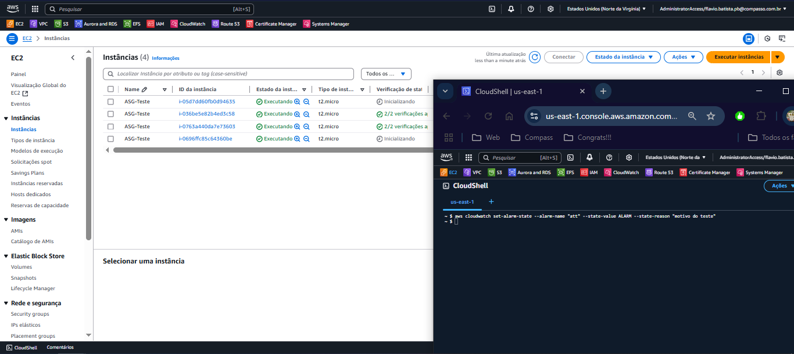

</div>

